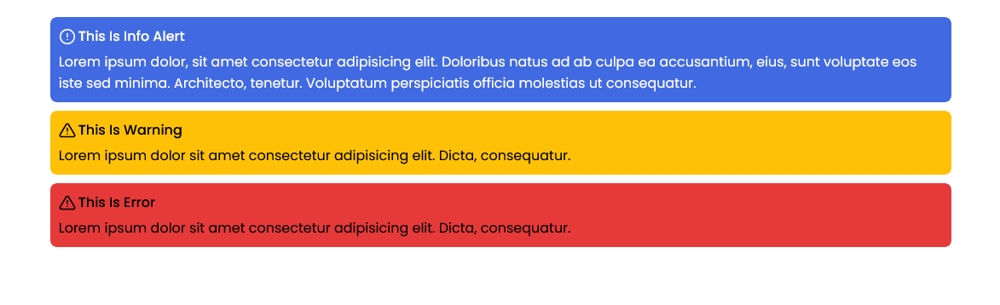

;
## React Admonition Component
with [React](https://reactjs.org/) and [Styled Components](https://www.styled-components.com/). 

component: 
```jsx
import React from 'react';
import styled from 'styled-components';

const AdmonitionStyles = styled.div`
  .admonition {
    color: black;
    padding: 1rem;
    border-radius: 8px;
  }
  .admonition-default {
    background: grey;
  }
  .admonition-info {
    background: #54c7ec;
  }
  .admonition-warning {
    background: #ffc107;
  }
  .admonition-error {
    background: #e63a3a;
  }
  .admonitionHeading {
    text-transform: Capitalize;
    display: flex;
    align-items: center;
    justify-content: flex-start;
    gap: 0.3rem;
  }
  .admonitionTitle{
    font-size: 1.6rem;
    font-weight: 500;
  }
  .admonitionIcon {
    margin: 0;
    display: flex;
    svg {
      width: 20px;
      height: 20px;
      stroke-width: 2;
      stroke: currentColor;
    }
  }
  .admonitionContent {
    margin-top: 0.5rem;
    font-size: 1.6rem;
  }
`;

const admonitionTypes = {
  default: 'default',
  info: 'info',
  warning: 'warning',
  error: 'error',
};

function Admonition({ title, icon, children, type = 'default', className }) {
  const getClasses = (classes) =>
    classes
      .filter((item) => item !== ' ')
      .join(' ')
      .trim();
  return (
    <AdmonitionStyles>
      <div
        className={getClasses([
          'admonition',
          `admonition-${admonitionTypes[type]}`,
          className,
        ])}
      >
        <div className="admonitionHeading">
          {icon && <div className="admonitionIcon">{icon}</div>}
          {title && (
            <h5 component="h5" className='admonitionTitle'>
              {title}
            </h5>
          )}
        </div>
        <div className="admonitionContent">
          {children}
        </div>
      </div>
    </AdmonitionStyles>
  );
}

export default Admonition;
```